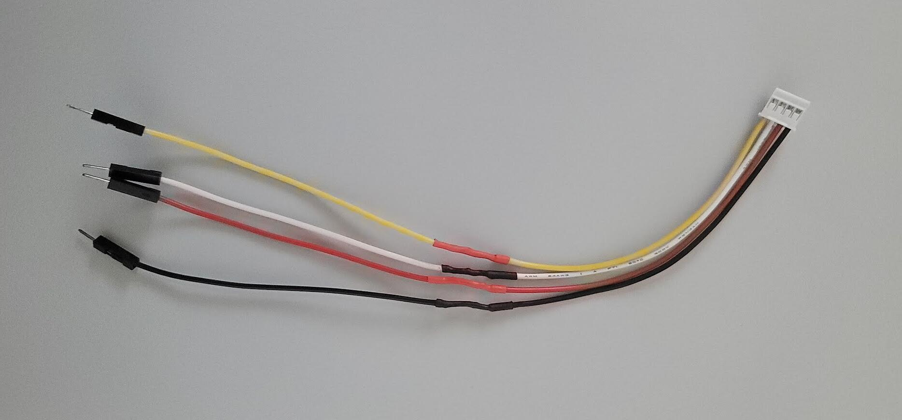
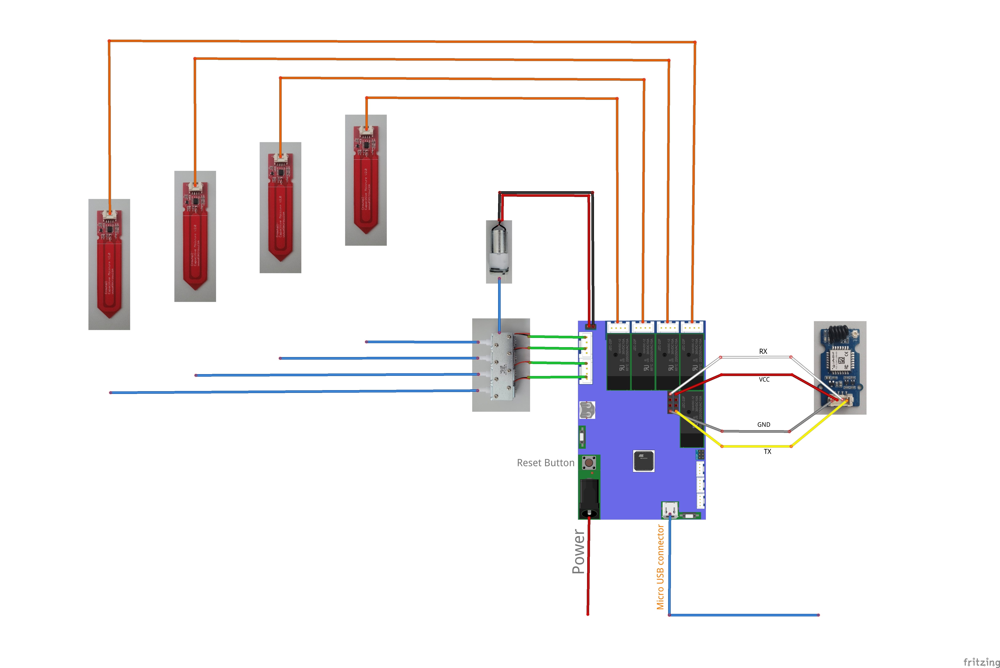
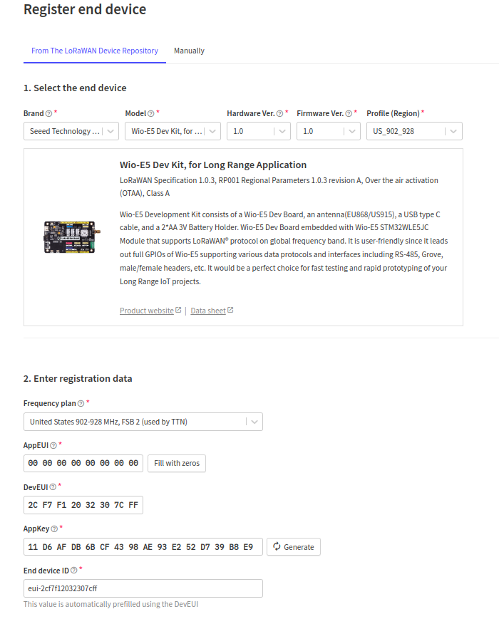
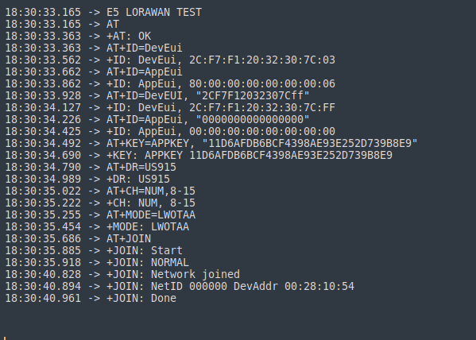

# Elecrow Watering kit with Grove Lora-E5

This project is to connect Elecrow Watering kit to Things LoRaWAN stack.

---
## Parts:

1. [Elecrow Plant Watering System Compatible with Arduino](https://www.amazon.com/dp/B07LCNKC6N)
2. [Grove - LoRa-E5](https://www.mouser.com/ProductDetail/Seeed-Studio/113020091?qs=DRkmTr78QARO7lCj00p5tg%3D%3D)
3. [Jumper wires](https://www.amazon.com/EDGELEC-Breadboard-Optional-Assorted-Multicolored/dp/B07GD2BWPY)
   
---
## Setup:

**Step 1.** Solder male jumper wires to Grove connector.  
To connect Grove LoRa-E5 board to Elecrow board, a grove to female header connector cable is required. Cut the grove connector cable and solder male connector cable. 
 

**Step 2.** Assemble the kit without the LCD screen.  
In this project LCD screen will not be used to reduce size of code.  
 

**Step 3.** Register new Device in ThingStack  
- Select Brand as `Seeed Technology Co. Ltd` from the dropdown
- Model as `Wio-E5 Dev Kit`.  
- Hardware and Firmware version is auto-selected as version 1.0.  
- Select region as `US_902_928`.  
- Select Frequency plan as `United States 902-928 MHz, FSB 2 (used by TTN)`
- Set AppEUI as all Zeros
- Each LoRa-E5 device has an unique DevEUI that can be identified by running `"AT+ID=DevEui"` AT-command. 

> Note: A new DevEUI can also be set with this AT-command `AT+ID=DevEUI, "2CF7F12032307CFF"`

 

**Step 4.** Launch watering_kit_with_Lora.ino with Arduino IDE  
Update config.h with values from **Step 3** and upload the code. Serial monitor output should be as shown below.  
 

